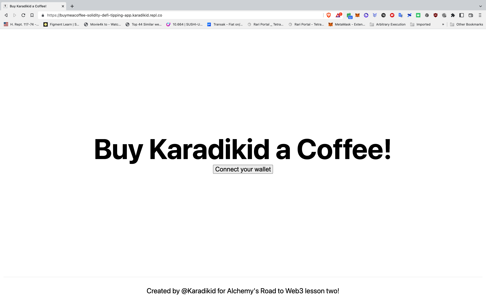
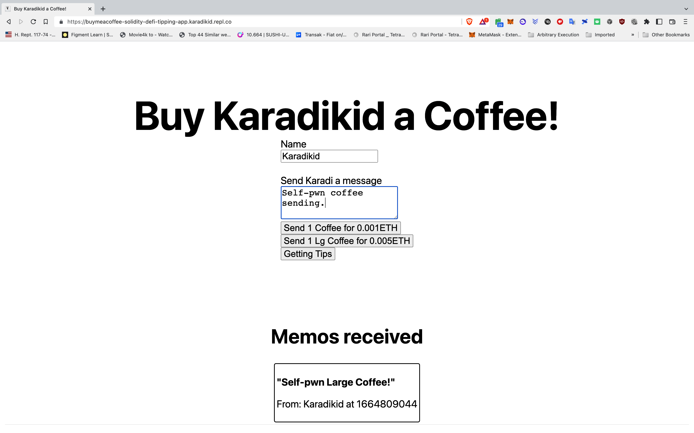

# Buy KaradiKid a Coffee

This project builds a simmple Buy Me a Coffee dApp which allows sending a tip and memo to an address based upon your Web3 wallet.


* Built using Hardhat
* Repl.it
* Deployed to Goerli


[Demo Website](https://buymeacoffee-solidity-defi-tipping-app--karadikid.repl.co/)

```
1. Connect Wallet
2. Ensure on appropriate Web3 Network (Ethereum Goerli)
4. For each button transaction (Send 1 Coffee, Send Large Coffee, Get Tips):
    a. Enter Name
    b. Write a friendly message
    c. Sign request
    d. Note messages in browser console confirming transactions.
```
### Landing Page

### Wallet Connected

